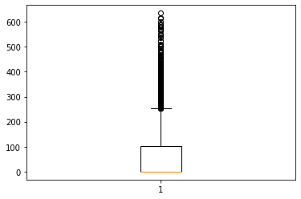

To check whether the bank loan is sanctioned or not
dep var personal loan
others are independent var
we dont consider zipcode and cust id coz they are identifiers, nominal scale,we dont use em for analysis


```python
import pandas as pd
```


```python
dataset=pd.read_excel("Bank_Personal_Loan_Modelling.xlsx",sheet_name=1)
```


```python
dataset.columns
```


    Index(['ID', 'Age', 'Experience', 'Income', 'ZIP Code', 'Family', 'CCAvg',
           'Education', 'Mortgage', 'Personal Loan', 'Securities Account',
           'CD Account', 'Online', 'CreditCard'],
          dtype='object')


```python
dataset1=dataset.dropna()
```


```python
dataset2=dataset1.drop_duplicates()
```


```python
dataset3=dataset.drop(['ID','ZIP Code'],axis=1)
```


```python
dataset3.columns
```


    Index(['Age', 'Experience', 'Income', 'Family', 'CCAvg', 'Education',
           'Mortgage', 'Personal Loan', 'Securities Account', 'CD Account',
           'Online', 'CreditCard'],
          dtype='object')


```python
#no text var so no need of performing preprocessing
```


```python
dataset3[['Age', 'Experience', 'Income', 'Family', 'CCAvg', 'Education',
       'Mortgage','Securities Account', 'CD Account',
       'Online', 'CreditCard']].mean()
```


    Age                   45.338400
    Experience            20.104600
    Income                73.774200
    Family                 2.396400
    CCAvg                  1.937913
    Education              1.881000
    Mortgage              56.498800
    Securities Account     0.104400
    CD Account             0.060400
    Online                 0.596800
    CreditCard             0.294000
    dtype: float64


```python
Bankloan_yes=dataset3[dataset3['Personal Loan']==1]
```


```python
Bankloan_no=dataset3[dataset3['Personal Loan']==0]
```


```python
#desciptive analysis
Bank_yes=Bankloan_yes.describe()
Bank_yes
```


<div>
<style scoped>
    .dataframe tbody tr th:only-of-type {
        vertical-align: middle;
    }

    .dataframe tbody tr th {
        vertical-align: top;
    }

    .dataframe thead th {
        text-align: right;
    }
</style>
<table border="1" class="dataframe">
  <thead>
    <tr style="text-align: right;">
      <th></th>
      <th>Age</th>
      <th>Experience</th>
      <th>Income</th>
      <th>Family</th>
      <th>CCAvg</th>
      <th>Education</th>
      <th>Mortgage</th>
      <th>Personal Loan</th>
      <th>Securities Account</th>
      <th>CD Account</th>
      <th>Online</th>
      <th>CreditCard</th>
    </tr>
  </thead>
  <tbody>
    <tr>
      <th>count</th>
      <td>480.000000</td>
      <td>480.000000</td>
      <td>480.000000</td>
      <td>480.000000</td>
      <td>480.000000</td>
      <td>480.000000</td>
      <td>480.000000</td>
      <td>480.0</td>
      <td>480.000000</td>
      <td>480.000000</td>
      <td>480.00000</td>
      <td>480.000000</td>
    </tr>
    <tr>
      <th>mean</th>
      <td>45.066667</td>
      <td>19.843750</td>
      <td>144.745833</td>
      <td>2.612500</td>
      <td>3.905347</td>
      <td>2.233333</td>
      <td>100.845833</td>
      <td>1.0</td>
      <td>0.125000</td>
      <td>0.291667</td>
      <td>0.60625</td>
      <td>0.297917</td>
    </tr>
    <tr>
      <th>std</th>
      <td>11.590964</td>
      <td>11.582443</td>
      <td>31.584429</td>
      <td>1.115393</td>
      <td>2.097679</td>
      <td>0.753373</td>
      <td>160.847862</td>
      <td>0.0</td>
      <td>0.331064</td>
      <td>0.455004</td>
      <td>0.48909</td>
      <td>0.457820</td>
    </tr>
    <tr>
      <th>min</th>
      <td>26.000000</td>
      <td>0.000000</td>
      <td>60.000000</td>
      <td>1.000000</td>
      <td>0.000000</td>
      <td>1.000000</td>
      <td>0.000000</td>
      <td>1.0</td>
      <td>0.000000</td>
      <td>0.000000</td>
      <td>0.00000</td>
      <td>0.000000</td>
    </tr>
    <tr>
      <th>25%</th>
      <td>35.000000</td>
      <td>9.000000</td>
      <td>122.000000</td>
      <td>2.000000</td>
      <td>2.600000</td>
      <td>2.000000</td>
      <td>0.000000</td>
      <td>1.0</td>
      <td>0.000000</td>
      <td>0.000000</td>
      <td>0.00000</td>
      <td>0.000000</td>
    </tr>
    <tr>
      <th>50%</th>
      <td>45.000000</td>
      <td>20.000000</td>
      <td>142.500000</td>
      <td>3.000000</td>
      <td>3.800000</td>
      <td>2.000000</td>
      <td>0.000000</td>
      <td>1.0</td>
      <td>0.000000</td>
      <td>0.000000</td>
      <td>1.00000</td>
      <td>0.000000</td>
    </tr>
    <tr>
      <th>75%</th>
      <td>55.000000</td>
      <td>30.000000</td>
      <td>172.000000</td>
      <td>4.000000</td>
      <td>5.350000</td>
      <td>3.000000</td>
      <td>192.500000</td>
      <td>1.0</td>
      <td>0.000000</td>
      <td>1.000000</td>
      <td>1.00000</td>
      <td>1.000000</td>
    </tr>
    <tr>
      <th>max</th>
      <td>65.000000</td>
      <td>41.000000</td>
      <td>203.000000</td>
      <td>4.000000</td>
      <td>10.000000</td>
      <td>3.000000</td>
      <td>617.000000</td>
      <td>1.0</td>
      <td>1.000000</td>
      <td>1.000000</td>
      <td>1.00000</td>
      <td>1.000000</td>
    </tr>
  </tbody>
</table>
</div>


```python
Bank_no=Bankloan_no.describe()
Bank_no
```


<div>
<style scoped>
    .dataframe tbody tr th:only-of-type {
        vertical-align: middle;
    }

    .dataframe tbody tr th {
        vertical-align: top;
    }

    .dataframe thead th {
        text-align: right;
    }
</style>
<table border="1" class="dataframe">
  <thead>
    <tr style="text-align: right;">
      <th></th>
      <th>Age</th>
      <th>Experience</th>
      <th>Income</th>
      <th>Family</th>
      <th>CCAvg</th>
      <th>Education</th>
      <th>Mortgage</th>
      <th>Personal Loan</th>
      <th>Securities Account</th>
      <th>CD Account</th>
      <th>Online</th>
      <th>CreditCard</th>
    </tr>
  </thead>
  <tbody>
    <tr>
      <th>count</th>
      <td>4520.000000</td>
      <td>4520.000000</td>
      <td>4520.000000</td>
      <td>4520.000000</td>
      <td>4520.000000</td>
      <td>4520.000000</td>
      <td>4520.000000</td>
      <td>4520.0</td>
      <td>4520.000000</td>
      <td>4520.000000</td>
      <td>4520.000000</td>
      <td>4520.000000</td>
    </tr>
    <tr>
      <th>mean</th>
      <td>45.367257</td>
      <td>20.132301</td>
      <td>66.237389</td>
      <td>2.373451</td>
      <td>1.728982</td>
      <td>1.843584</td>
      <td>51.789381</td>
      <td>0.0</td>
      <td>0.102212</td>
      <td>0.035841</td>
      <td>0.595796</td>
      <td>0.293584</td>
    </tr>
    <tr>
      <th>std</th>
      <td>11.450427</td>
      <td>11.456672</td>
      <td>40.578534</td>
      <td>1.148771</td>
      <td>1.567654</td>
      <td>0.839975</td>
      <td>92.038931</td>
      <td>0.0</td>
      <td>0.302961</td>
      <td>0.185913</td>
      <td>0.490792</td>
      <td>0.455454</td>
    </tr>
    <tr>
      <th>min</th>
      <td>23.000000</td>
      <td>-3.000000</td>
      <td>8.000000</td>
      <td>1.000000</td>
      <td>0.000000</td>
      <td>1.000000</td>
      <td>0.000000</td>
      <td>0.0</td>
      <td>0.000000</td>
      <td>0.000000</td>
      <td>0.000000</td>
      <td>0.000000</td>
    </tr>
    <tr>
      <th>25%</th>
      <td>35.000000</td>
      <td>10.000000</td>
      <td>35.000000</td>
      <td>1.000000</td>
      <td>0.600000</td>
      <td>1.000000</td>
      <td>0.000000</td>
      <td>0.0</td>
      <td>0.000000</td>
      <td>0.000000</td>
      <td>0.000000</td>
      <td>0.000000</td>
    </tr>
    <tr>
      <th>50%</th>
      <td>45.000000</td>
      <td>20.000000</td>
      <td>59.000000</td>
      <td>2.000000</td>
      <td>1.400000</td>
      <td>2.000000</td>
      <td>0.000000</td>
      <td>0.0</td>
      <td>0.000000</td>
      <td>0.000000</td>
      <td>1.000000</td>
      <td>0.000000</td>
    </tr>
    <tr>
      <th>75%</th>
      <td>55.000000</td>
      <td>30.000000</td>
      <td>84.000000</td>
      <td>3.000000</td>
      <td>2.300000</td>
      <td>3.000000</td>
      <td>98.000000</td>
      <td>0.0</td>
      <td>0.000000</td>
      <td>0.000000</td>
      <td>1.000000</td>
      <td>1.000000</td>
    </tr>
    <tr>
      <th>max</th>
      <td>67.000000</td>
      <td>43.000000</td>
      <td>224.000000</td>
      <td>4.000000</td>
      <td>8.800000</td>
      <td>3.000000</td>
      <td>635.000000</td>
      <td>0.0</td>
      <td>1.000000</td>
      <td>1.000000</td>
      <td>1.000000</td>
      <td>1.000000</td>
    </tr>
  </tbody>
</table>
</div>


```python
import matplotlib.pyplot as plt
```


```python
plt.hist(dataset3.Income)
```


    (array([ 802., 1153.,  867.,  879.,  377.,  307.,  268.,  197.,  141.,
               9.]),
     array([  8. ,  29.6,  51.2,  72.8,  94.4, 116. , 137.6, 159.2, 180.8,
            202.4, 224. ]),
     <BarContainer object of 10 artists>)


```python
plt.hist(dataset3.CCAvg)
```


    (array([1683., 1376., 1039.,  319.,  219.,   97.,  132.,   84.,   45.,
               6.]),
     array([ 0.,  1.,  2.,  3.,  4.,  5.,  6.,  7.,  8.,  9., 10.]),
     <BarContainer object of 10 artists>)


```python
plt.hist(dataset3.Age)
```


    (array([262., 487., 632., 479., 532., 600., 524., 678., 504., 302.]),
     array([23. , 27.4, 31.8, 36.2, 40.6, 45. , 49.4, 53.8, 58.2, 62.6, 67. ]),
     <BarContainer object of 10 artists>)


```python
plt.hist(dataset3.Mortgage)
```


    (array([3462.,  566.,  428.,  254.,  127.,   73.,   46.,   20.,   14.,
              10.]),
     array([  0. ,  63.5, 127. , 190.5, 254. , 317.5, 381. , 444.5, 508. ,
            571.5, 635. ]),
     <BarContainer object of 10 artists>)


```python
plt.boxplot(dataset3.Age)
```


    {'whiskers': [<matplotlib.lines.Line2D at 0x27a35afaa90>,
      <matplotlib.lines.Line2D at 0x27a35afadf0>],
     'caps': [<matplotlib.lines.Line2D at 0x27a2c499190>,
      <matplotlib.lines.Line2D at 0x27a2c4994f0>],
     'boxes': [<matplotlib.lines.Line2D at 0x27a35afa790>],
     'medians': [<matplotlib.lines.Line2D at 0x27a2c499850>],
     'fliers': [<matplotlib.lines.Line2D at 0x27a2c499bb0>],
     'means': []}


```python
plt.boxplot(dataset3.Income)
```


    {'whiskers': [<matplotlib.lines.Line2D at 0x27a35a064c0>,
      <matplotlib.lines.Line2D at 0x27a35a06820>],
     'caps': [<matplotlib.lines.Line2D at 0x27a35a06b80>,
      <matplotlib.lines.Line2D at 0x27a35a06ee0>],
     'boxes': [<matplotlib.lines.Line2D at 0x27a35a06160>],
     'medians': [<matplotlib.lines.Line2D at 0x27a359e3280>],
     'fliers': [<matplotlib.lines.Line2D at 0x27a359e35e0>],
     'means': []}


```python
plt.boxplot(dataset3.Mortgage)
```


    {'whiskers': [<matplotlib.lines.Line2D at 0x27a359173a0>,
      <matplotlib.lines.Line2D at 0x27a35917700>],
     'caps': [<matplotlib.lines.Line2D at 0x27a35917a60>,
      <matplotlib.lines.Line2D at 0x27a35917dc0>],
     'boxes': [<matplotlib.lines.Line2D at 0x27a35917040>],
     'medians': [<matplotlib.lines.Line2D at 0x27a3592d160>],
     'fliers': [<matplotlib.lines.Line2D at 0x27a3592d4c0>],
     'means': []}





```python
plt.boxplot(dataset3.CCAvg)
```


    {'whiskers': [<matplotlib.lines.Line2D at 0x27a3598ad60>,
      <matplotlib.lines.Line2D at 0x27a35951100>],
     'caps': [<matplotlib.lines.Line2D at 0x27a35951460>,
      <matplotlib.lines.Line2D at 0x27a359517c0>],
     'boxes': [<matplotlib.lines.Line2D at 0x27a3598aa00>],
     'medians': [<matplotlib.lines.Line2D at 0x27a35951b20>],
     'fliers': [<matplotlib.lines.Line2D at 0x27a35951e80>],
     'means': []}


```python
#Inferential stats   use continuous var
```


```python
plt.hist(dataset3.Experience)
```


    (array([192., 592., 505., 581., 524., 660., 663., 501., 586., 196.]),
     array([-3. ,  1.6,  6.2, 10.8, 15.4, 20. , 24.6, 29.2, 33.8, 38.4, 43. ]),
     <BarContainer object of 10 artists>)


```python
#Normally dis cols are Age,experience,Income(inc is almost normally dist)
#so for normally dist we use Parametric trst
#Not normal MOrgaGE CCavg
# not normal we use nonparametric test
#remaining are categorucal var edu,fam,security acc,cd acc
#categorical  chi square test
```

# Parametric test  #population var is used (mean,med,mode)
#Independent sample T-test


```python
from scipy.stats import ttest_ind
```


```python
stats,p=ttest_ind(Bankloan_yes.Age,Bankloan_no.Age)
```


```python
print(stats,p) 
#p val > 0.05 accept null hypo,H0 there is no significant difference in sanction of lon wrt age
#hence age is not a significant parameter
```

    -0.5461906615539323 0.584959263705325
    


```python
stats,p=ttest_ind(Bankloan_yes.Experience,Bankloan_no.Experience)
```


```python
print(stats,p) #p>0.05 ,null hypo ,H0
#experience  is not considered as significant parameter
```

    -0.5240947451995412 0.600235883164189
    


```python
stats,p=ttest_ind(Bankloan_yes.Income,Bankloan_no.Income)
```


```python
print(stats,p) #p<0.05 , H1 alternate hypo is accepted
#hence there is a significance difference in sanction of loan wrt Income
```

    41.08533291207552 0.0
    

Non Parametric (without using the population parameter)
Mannwhitney  (it is used to compare two independent sample)


```python
from scipy.stats import mannwhitneyu
```


```python
stats,p=mannwhitneyu(Bankloan_yes.Mortgage,Bankloan_no.Mortgage)
```


```python
print(stats,p)   #p value < 0.05 H0 is rejected
#alternate hypo is accepted
##hence there is a significance difference in sanction of loan wrt mortgage
```

    974814.5 3.819046433025639e-06
    


```python
3.819046433025639e-06 < 0.05
```


    True


```python
stats,p=mannwhitneyu(Bankloan_yes.CCAvg,Bankloan_no.CCAvg)
```


```python
print(stats,p) #p value < 0.05 null hpo is rejected
#alternate hypo is accepted
##hence there is a significance difference in sanction of loan wrt ccavg
```

    417591.0 1.7997250113260796e-109
    

#categorical var
Chi sqaure test


```python
from scipy.stats import chi2_contingency
```


```python
chitable=pd.crosstab(dataset3['Personal Loan'],dataset3["Education"])
chitable
```


<div>
<style scoped>
    .dataframe tbody tr th:only-of-type {
        vertical-align: middle;
    }

    .dataframe tbody tr th {
        vertical-align: top;
    }

    .dataframe thead th {
        text-align: right;
    }
</style>
<table border="1" class="dataframe">
  <thead>
    <tr style="text-align: right;">
      <th>Education</th>
      <th>1</th>
      <th>2</th>
      <th>3</th>
    </tr>
    <tr>
      <th>Personal Loan</th>
      <th></th>
      <th></th>
      <th></th>
    </tr>
  </thead>
  <tbody>
    <tr>
      <th>0</th>
      <td>2003</td>
      <td>1221</td>
      <td>1296</td>
    </tr>
    <tr>
      <th>1</th>
      <td>93</td>
      <td>182</td>
      <td>205</td>
    </tr>
  </tbody>
</table>
</div>


```python
stats,p,dof,expected = chi2_contingency(chitable)
```


```python
print(stats,p)   #p val < 0.05
#alternate hypo is accepted
##hence there is a significance difference in sanction of loan wrt education
```

    111.2398718738913 6.991473868665428e-25
    


```python
chitable=pd.crosstab(dataset3['Personal Loan'],dataset3["Family"])
chitable
```


<div>
<style scoped>
    .dataframe tbody tr th:only-of-type {
        vertical-align: middle;
    }

    .dataframe tbody tr th {
        vertical-align: top;
    }

    .dataframe thead th {
        text-align: right;
    }
</style>
<table border="1" class="dataframe">
  <thead>
    <tr style="text-align: right;">
      <th>Family</th>
      <th>1</th>
      <th>2</th>
      <th>3</th>
      <th>4</th>
    </tr>
    <tr>
      <th>Personal Loan</th>
      <th></th>
      <th></th>
      <th></th>
      <th></th>
    </tr>
  </thead>
  <tbody>
    <tr>
      <th>0</th>
      <td>1365</td>
      <td>1190</td>
      <td>877</td>
      <td>1088</td>
    </tr>
    <tr>
      <th>1</th>
      <td>107</td>
      <td>106</td>
      <td>133</td>
      <td>134</td>
    </tr>
  </tbody>
</table>
</div>


```python
stats,p,dof,expected = chi2_contingency(chitable)
```


```python
print(stats,p) #p,0.05
#alternate hypo is accepted
##hence there is a significance difference in sanction of loan wrt family
```

    29.676116414854746 1.6144121228248757e-06
    


```python
chitable=pd.crosstab(dataset3['Personal Loan'],dataset3["Securities Account"])
chitable
```


<div>
<style scoped>
    .dataframe tbody tr th:only-of-type {
        vertical-align: middle;
    }

    .dataframe tbody tr th {
        vertical-align: top;
    }

    .dataframe thead th {
        text-align: right;
    }
</style>
<table border="1" class="dataframe">
  <thead>
    <tr style="text-align: right;">
      <th>Securities Account</th>
      <th>0</th>
      <th>1</th>
    </tr>
    <tr>
      <th>Personal Loan</th>
      <th></th>
      <th></th>
    </tr>
  </thead>
  <tbody>
    <tr>
      <th>0</th>
      <td>4058</td>
      <td>462</td>
    </tr>
    <tr>
      <th>1</th>
      <td>420</td>
      <td>60</td>
    </tr>
  </tbody>
</table>
</div>


```python
stats,p,dof,expected = chi2_contingency(chitable)
```


```python
print(stats,p) #p val > 0.05 null hypo is accepted
```

    2.172310545186504 0.14051497326319357
    


```python
chitable=pd.crosstab(dataset3['Personal Loan'],dataset3["CD Account"])
chitable
```


<div>
<style scoped>
    .dataframe tbody tr th:only-of-type {
        vertical-align: middle;
    }

    .dataframe tbody tr th {
        vertical-align: top;
    }

    .dataframe thead th {
        text-align: right;
    }
</style>
<table border="1" class="dataframe">
  <thead>
    <tr style="text-align: right;">
      <th>CD Account</th>
      <th>0</th>
      <th>1</th>
    </tr>
    <tr>
      <th>Personal Loan</th>
      <th></th>
      <th></th>
    </tr>
  </thead>
  <tbody>
    <tr>
      <th>0</th>
      <td>4358</td>
      <td>162</td>
    </tr>
    <tr>
      <th>1</th>
      <td>340</td>
      <td>140</td>
    </tr>
  </tbody>
</table>
</div>


```python
stats,p,dof,expected = chi2_contingency(chitable)
print(stats,p)  #p , 0.05
#alternate hypothesis
##hence there is a significance difference in sanction of loan wrt Causal Depositaccount
```

    495.90424218782334 7.398297503329848e-110
    


```python

```
